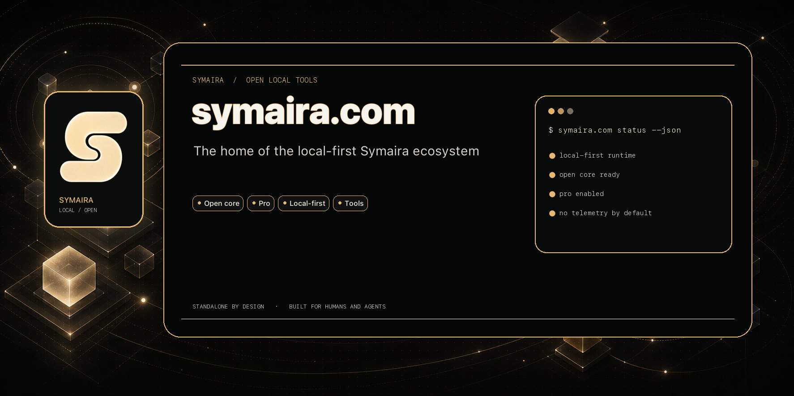

# symaira.com

[](https://github.com/danieljustus/symaira.com/actions/workflows/ci.yml)
[](https://github.com/danieljustus/symaira.com/releases/latest)



Public website for the Symaira ecosystem.

Symaira tools follow one product model: free, open-source, self-hosted cores.
There are no paid or cloud-hosted editions — each tool ships exactly once.

## Current Public Story

The site currently presents dedicated pages for 17 tools: Vault, Memory, Seek,
Fetch, Scope, EraseMe, Terminal, Vibecoder, Operate, Tune, Fritz, Guard, Print,
Skills, Ingest, Desktop, and Meet (see `src/config/products.tsx` and the route
table in `src/App.tsx`).

## Development

```bash
npm install
npm run dev
npm run build
```

## Stack

- React
- TypeScript
- Vite
- lucide-react

## Ecosystem Rule

The website should not promise hosted Pro availability before the corresponding
public core has a tagged release and a documented Pro/Core runtime contract.
