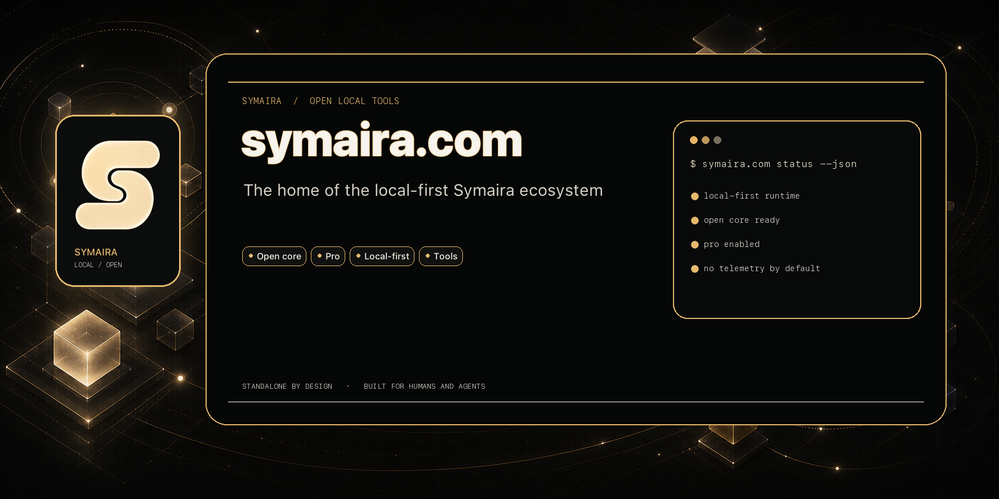

# Symaira

[](https://github.com/danieljustus/symaira.com/actions/workflows/ci.yml) [](https://github.com/danieljustus/symaira.com/releases/latest) [](LICENSE)



> Public website for the Symaira local-first AI tool ecosystem.

**Status:** Published static website; see [CHANGELOG.md](CHANGELOG.md).

**Current product state, source/consumer cutover completed 2026-09-13:** Desktop and Brain are the primary products; Cockpit, EraseMe and Fritz are specialized products. Browse, Operate and Scope are optional Brain modules. Their sources and direct consumers are cut over, Browse's former repository is archived, and Cockpit is tune-only. No signed Brain-module release or package-manager migration has been published. See [PB-2026-09-09](docs/product-boundaries.md).

Symaira tools follow one product model: free, open-source, self-hosted cores.
There are no paid or cloud-hosted editions — each tool ships exactly once.

## Current Public Story

The site currently presents seven dedicated pages: Credential Vault (`symvault`),
Brain, Desktop, Browse, EraseMe, Cockpit and Fritz (see
`src/config/products.tsx` and the route table in `src/App.tsx`).
These pages are not seven independent primary products: Browse is an optional
Brain module, and Credential Vault remains an independent technical service/CLI.

The absorbed tools no longer have their own pages or routes: Memory, Skills and
Guard live inside Brain; Seek, Print, Ingest, Meet, Relate and Room inside
Desktop; Fetch inside Brain's Browse module; hardware tuning inside Cockpit;
Operate and Scope inside Brain. Their capabilities are described as features of
the surviving tool.

## Development

```bash
npm ci
npm run dev
npm run build
```

Production output is written to `dist/`. Run `npm run preview` to inspect it,
`npm run lint` for ESLint and `npm run test` for the Vitest suite.
The site uses hash routing and hardcoded EN/DE content, with no CMS or router library.

## Stack

- React
- TypeScript
- Vite
- lucide-react

## Documentation

- [Product and execution boundaries (PB-2026-09-09)](docs/product-boundaries.md)
- [Changelog](CHANGELOG.md)

## Ecosystem

[symaira.com](https://symaira.com) presents the following source ownership:

| Product or capability | Source | Role |
|---|---|---|
| Symaira Desktop | [symaira-desktop](https://github.com/danieljustus/symaira-desktop) | Primary document and knowledge-work product |
| Symaira Brain | [symaira-brain](https://github.com/danieljustus/symaira-brain) | Primary portable agent-context and administration product |
| Symaira Cockpit | [symaira-cockpit](https://github.com/danieljustus/symaira-cockpit) | Independent hardware/system tuning |
| Symaira EraseMe | [symaira-eraseme](https://github.com/danieljustus/symaira-eraseme) | Independent privacy workflows |
| Symaira Fritz | [symaira-fritz](https://github.com/danieljustus/symaira-fritz) | Independent FRITZ!Box administration |
| Credential Vault (`symvault`) | [symaira-vault](https://github.com/danieljustus/symaira-vault) | Independent credential service/CLI; integrated management UI belongs to Brain |
| Browse, Operate and Scope | [browse](https://github.com/danieljustus/symaira-brain/tree/main/browse), [operate](https://github.com/danieljustus/symaira-brain/tree/main/operate), [scope](https://github.com/danieljustus/symaira-brain/tree/main/scope) | Optional Brain modules, not independent primary products |

### Ecosystem Rule

The website should not promise hosted Pro availability before the corresponding
public core has a tagged release and a documented Pro/Core runtime contract.

## Contributing · Security · License

See [contribution guidance](.github/CONTRIBUTING.md), the
[security policy](.github/SECURITY.md) and [LICENSE](LICENSE).
The website source is proprietary; the open-source core product model above
does not grant an open-source license to this repository.
